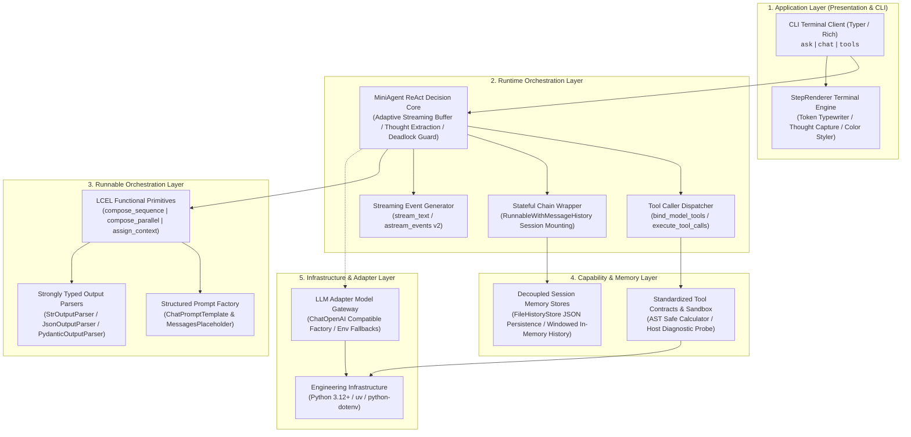
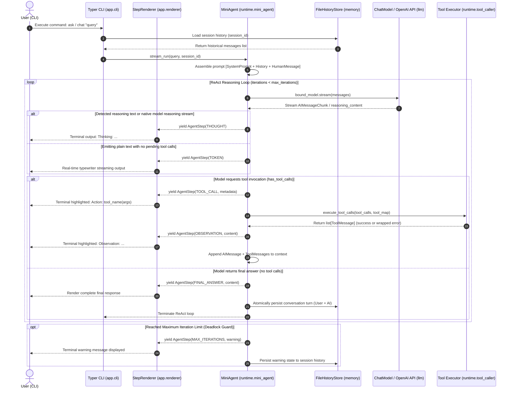

# AgentFlow

> **A Lightweight Single-Agent ReAct Runtime & LCEL Engineering Reference, evolved from Vanilla Runtimes.**  
> *Built on LangChain LCEL Core Primitives, Unified Runnable Protocol, and Decoupled Session Memory.*

[](https://www.python.org/downloads/)
[](https://python.langchain.com/)
[](https://github.com/astral-sh/uv)
[](https://github.com/astral-sh/ruff)
[](tests/)

[ 简体中文 ](README.md) | [ English ](README.en.md)

---

## 1. Overview

### What is AgentFlow?
**AgentFlow** is a lightweight, production-grade autonomous Single-Agent ReAct runtime reference implementation and engineering system. Built upon the LangChain Expression Language (LCEL) and the unified `Runnable` protocol as its computational backbone, it systematically deconstructs and implements an end-to-end autonomous agent loop featuring dual-mode thought capture, dynamic tool calling, adaptive typewriter token streaming, and session-isolated persistent memory.

### Why does it exist?
When engineering autonomous agent systems, developers often face a dilemma: custom in-house runtimes carry excessive maintenance burdens, while jumping straight into complex state-graph frameworks creates unnecessary cognitive overload. Traditional vanilla or first-generation agent runtimes expose several critical bottlenecks:
1. **Fragmented Protocols & Glue Code Bloat**: Model API formats differ across providers, requiring extensive boilerplate to convert raw JSON payloads into internal message dictionaries.
2. **Lack of Unified Functional Composition**: Imperative, deeply nested function calls cannot seamlessly provide synchronous (`invoke`), asynchronous (`ainvoke`), streaming (`stream`), and batch (`batch`) capabilities at zero additional cost.
3. **Broken Streaming Pipelines & TTFT Latency**: Introducing parsers or formatting nodes into custom streaming pipelines often leads to buffer stalls, with no clean way to distinguish intermediate thoughts from final answers.
4. **Fragile Tool Schemas & Lack of Sandboxing**: Relying on manual introspection to generate JSON Schemas frequently causes schema validation errors; unhandled exceptions inside tools easily crash the entire runtime process.
5. **Coupled State & Hardcoded Storage**: Storing conversation histories directly as `self.history = []` inside Agent class instances causes memory leaks across concurrent sessions and prevents storage backends from being cleanly swapped.
6. **Unprotected Loops & Context Contamination**: Imperative `while` loops risk infinite execution due to model hallucinations, while metadata parameters (`session_id`, `trace_id`) pollute business function signatures.

AgentFlow resolves these challenges by adhering to a clear design philosophy: **Pure Functional Pipelines, Decoupled State & Memory, Strongly Typed Tool Contracts, Adaptive Token Streaming, and Deadlock Guarding**. Without pulling in heavy graph dependencies, AgentFlow delivers an industrial-grade foundation for single-agent execution.

---

## 2. Implemented Features

> **Current Status**: All architectural evolution phases are **100% completed**, verified by 43 unit and integration tests (100% PASS).

- **Declarative LCEL Pipeline Composition**: Standard `Runnable` abstraction and overloaded pipe operator (`|`), providing sequential pipelines (`compose_sequence`), parallel branches (`compose_parallel`), lambda wrappers (`make_lambda`), and passthrough assignments (`assign_context`).
- **MiniAgent ReAct Closed Loop**: Single-step reasoning driven by the LCEL model pipeline, with an outer lightweight control loop enforcing max iteration protection (`max_iterations`, default 5) to prevent infinite execution loops.
- **Dual-Mode Low-Latency Thought Capture**:
  - **Native Reasoning Streams**: Real-time extraction of `reasoning_content` delta tokens from DeepSeek-R1 / reasoner models;
  - **Preamble Intent Extraction**: Intelligently captures natural language reasoning emitted prior to tool calls and elevates it to `THOUGHT` events, providing sub-second (<0.3s) terminal visual feedback.
- **Strict Tool Contracts & Safe Sandboxing**: Automatic OpenAI Function Calling schema derivation using `@tool` and Pydantic `BaseModel`. Includes a secure mathematical evaluator recursively evaluating Python AST nodes (eliminating dynamic `eval` security risks) and host diagnostic probes.
- **Dynamic Adaptive Typewriter Token Streaming**:
  - Two-stage streaming buffer: 100-character adaptive buffer on non-tool rounds to prevent premature printing, zero-delay direct passthrough on tool synthesis rounds;
  - Integrated with the `StepRenderer` terminal engine for real-time typewriter effect;
  - Supports fine-grained lifecycle event streams via LangChain `astream_events` v2.
- **Stateless Core with Persistent Session Memory**:
  - Multi-session physical isolation driven by `session_id`;
  - `WindowedChatMessageHistory`: Thread-isolated in-memory queue with automatic sliding window truncation;
  - `FileHistoryStore`: Persistent file storage at `.sessions/{session_id}.json` using LangChain's official `message_to_dict` / `messages_from_dict` for lossless serialization;
  - `runtime/stateful_chain.py`: Provides `RunnableWithMessageHistory` wrapper to equip any stateless LCEL chain with multi-turn conversation memory.
- **Production Terminal CLI**:
  - `jarvis ask`: Single-turn execution with tool invocation, typewriter streaming, and automatic context persistence;
  - `jarvis chat`: Interactive terminal REPL supporting `/quit` and `/clear` commands;
  - `jarvis tools`: Displays formatted table of all registered tools and their input parameters schema.
- **Universal LLM Gateway Adapter**:
  - Unified `get_chat_model()` in `llm/client.py` connecting to OpenAI, DeepSeek, Moonshot, and local Ollama endpoints;
  - Environment variable fallback (`OPENAI_MODEL_NAME`, `OPENAI_API_KEY`, `OPENAI_BASE_URL`).
- **100% Offline Automated Test Gate**: 43 automated unit and integration tests verifying infrastructure, LCEL primitives, prompt templates, tool sandboxes, token streaming, memory persistence, and end-to-end ReAct loops with zero external network dependencies.

---

## 3. Architecture

AgentFlow enforces a strict, layered, decoupled architecture with clear responsibility boundaries:



### Core Execution Flow (ReAct Decision & Tool Invocation Loop)



---

## 4. Core Concepts

| Core Concept | Definition & Responsibility in AgentFlow |
| :--- | :--- |
| **MiniAgent** | Compact ReAct agent orchestrating the reasoning loop: Thought $\to$ Action $\to$ Tool Execution $\to$ Observation $\to$ Synthesis. |
| **Runnable Protocol** | Foundational LangChain abstraction exposing unified `invoke`, `batch`, `stream`, `ainvoke`, and `astream` contracts. |
| **LCEL Composition** | Overloaded pipe operator (`|`) supporting sequential pipelines (`compose_sequence`), parallel branches (`compose_parallel`), and context assignments (`assign_context`). |
| **AgentStep** | Runtime event abstraction covering `THOUGHT`, `TOOL_CALL`, `OBSERVATION`, `TOKEN`, `FINAL_ANSWER`, and `MAX_ITERATIONS`. |
| **Tool Sandbox Contract** | Self-describing tools built on Pydantic schemas; runtime exceptions are safely caught and returned as `ToolMessage(status="error")` for self-correction. |
| **FileHistoryStore** | Local JSON storage manager (`.sessions/{session_id}.json`) providing cross-command session persistence and automatic sliding window truncation. |
| **WindowedChatMessageHistory** | In-memory message history enforcing a strict message limit (`max_messages`) to prevent token window overflow. |
| **StepRenderer** | Terminal output engine converting low-level `AgentStep` events into a smooth, low-latency typewriter visual stream. |

---

## 5. Project Structure

```text
AgentFlow/
├── app/                  # Application & presentation layer (Typer CLI, formatting renderer)
│   ├── cli.py            # CLI commands: ask, chat, tools
│   ├── main.py           # Typer entrypoint & package distribution
│   └── renderer.py       # StepRenderer typewriter and event styler
├── runtime/              # Runtime orchestration layer (MiniAgent, LCEL pipelines, tool dispatch)
│   ├── mini_agent.py     # MiniAgent ReAct loop, adaptive buffering & deadlock guard
│   ├── runnables.py      # LCEL pure functional primitives (sequence, parallel, passthrough)
│   ├── stateful_chain.py # Stateful RunnableWithMessageHistory wrapper & execution
│   ├── streaming.py      # Text & structured event streaming generators (astream_events v2)
│   └── tool_caller.py    # Model tool binding (bind_tools) & safe execution dispatch
├── llm/                  # Model adapter layer (OpenAI / DeepSeek / Ollama unified interface)
│   └── client.py         # get_chat_model unified factory function
├── prompts/              # Structured prompt engineering & output parsing
│   ├── templates.py      # ChatPromptTemplate & MessagesPlaceholder factories
│   └── parser.py         # String, JSON & Pydantic output parsers
├── tools/                # Standardized tool definitions (BaseTool / @tool)
│   ├── calculator.py     # Safe math evaluator via Python AST parsing
│   └── system.py         # Host system and runtime environment probe
├── memory/               # Session state persistence & chat history
│   └── history.py        # In-memory sliding window & JSON file history store
├── docs/                 # System architecture, design docs, ADRs & roadmap
├── tests/                # 43 automated unit and integration tests (100% PASS)
├── pyproject.toml        # Dependencies and project metadata configuration
├── .env.example          # Environment configuration template
└── uv.lock               # Cross-platform dependency lockfile
```

---

## 6. Getting Started

### 6.1 Prerequisites
- **Python**: `>= 3.12` (verified on Python 3.12 and Python 3.14)
- **Package Manager**: [uv](https://github.com/astral-sh/uv) (recommended for speed and determinism)

### 6.2 Installation & Dependency Sync

```bash
# 1. Clone repository
git clone <repository_url>
cd AgentFlow

# 2. Sync dependencies and create virtual environment using uv
uv sync

# 3. Create environment configuration file
cp .env.example .env    # Linux / macOS
# Or on Windows PowerShell:
# Copy-Item .env.example .env
```

### 6.3 Quick CLI Usage

```bash
# 1. Discover registered tools and their parameter schemas
uv run python -m app tools

# 2. Single-turn query: invokes AST calculator and system probe with typewriter streaming
uv run python -m app ask "Calculate (123 * 45) + 678 and report the host system"

# 3. Multi-session memory persistence (maintains context across commands)
uv run python -m app ask "Hi, my name is Alice" --session-id user_01
uv run python -m app ask "What is my name?" --session-id user_01

# 4. Interactive multi-turn REPL chat session
uv run python -m app chat --session-id test_chat
```

> **Note**: The console script registered in `pyproject.toml` is `jarvis`. You can execute commands via `uv run jarvis <command>` or `uv run python -m app <command>` interchangeably.

### 6.4 Connecting Real LLMs

AgentFlow natively supports any OpenAI-compatible provider (OpenAI, DeepSeek, Moonshot, Ollama, etc.). Edit your `.env` file:

```dotenv
# Required: LLM API key
OPENAI_API_KEY=your_actual_api_key_here

# Optional: Custom endpoint (e.g., DeepSeek or local Ollama)
OPENAI_BASE_URL=https://api.openai.com/v1

# Optional: Default model identifier (e.g., deepseek-chat or gpt-4o-mini)
OPENAI_MODEL_NAME=gpt-4o-mini
```

### 6.5 Running Full Test Suite

```bash
uv run pytest
```
*All 43 unit and integration tests run offline with mock/scripted models and pass in under 4 seconds.*

---

## 7. Configuration

| Environment Variable | Default Value | Description |
| :--- | :--- | :--- |
| `OPENAI_API_KEY` | `dummy-key-for-local-dev` | LLM API access key (required for live queries; automated tests run offline with mock models). |
| `OPENAI_BASE_URL` | `https://api.openai.com/v1` | Compatible API endpoint (e.g., DeepSeek `https://api.deepseek.com/v1`, Ollama `http://localhost:11434/v1`). |
| `OPENAI_MODEL_NAME` | `gpt-4o-mini` | Default model identifier (e.g., `deepseek-chat`, `gpt-4o`, `qwen2.5:7b`). |

Session files are stored by default at `.sessions/{session_id}.json` in the current working directory.

---

## 8. Development & Quality Gates

This project strictly adheres to quality gate discipline:

```bash
# Run static linting (Ruff)
uv run ruff check .

# Check code formatting (Black)
uv run black --check .

# Run unit and integration tests (43 passed tests)
uv run pytest -v
```

---

## 9. Documentation Index

Comprehensive design specifications and architectural analyses are maintained under `docs/`:

```text
docs/
├── architecture/                     # Architecture & migration analysis
│   ├── system-architecture.md        # 6-layer architecture, data flow & boundary rules
│   └── migration-map.md              # Custom runtime vs LangChain LCEL 9-dimension mapping matrix
├── design/                           # Component-level design specifications
│   ├── mini-agent.md                 # MiniAgent ReAct loop & streaming buffer design
│   └── tools-and-memory.md           # Tool sandboxing & session file persistence
├── development/                      # Developer guide & engineering rules
│   └── development-guide.md          # Setup, configuration, CLI usage, tests & quality gates
├── adr/                              # Architecture Decision Records (ADRs)
│   ├── ADR-001-why-langchain.md      # ADR-001: Why choose LangChain LCEL as the reference
│   ├── ADR-002-runnable-first.md     # ADR-002: Why prioritize Runnable primitives
│   ├── ADR-003-no-langgraph-yet.md   # ADR-003: Why defer LangGraph to subsequent phases
│   └── ADR-004-session-file-memory.md# ADR-004: Why use local JSON file storage for memory
└── roadmap/                          # Roadmap & evolutionary milestones
    └── roadmap.md                    # Phased deliverables for Phase 0-8 & future outlook
```

---

## 10. Roadmap

All nine architectural evolution phases have been **100% completed and verified**:

### Completed
- ✅ **Phase 0: Design Gate**: Architecture blueprint, concept mapping matrix, and ADR records.
- ✅ **Phase 1: Project Skeleton**: Modern Python modular layered skeleton with single-directional dependencies.
- ✅ **Phase 2: Dev Infrastructure**: Toolchain setup with uv, Ruff, Black, and pytest smoke test foundations.
- ✅ **Phase 3: Runnable Foundation**: Unified LCEL pipeline primitives (`compose_sequence`, `compose_parallel`, `assign_context`).
- ✅ **Phase 4: Prompt Engineering**: Structured `ChatPromptTemplate` factories and Pydantic output parsers.
- ✅ **Phase 5: Tool Calling**: `@tool` schema binding, safe AST math evaluator, and host diagnostic probes.
- ✅ **Phase 6: Streaming**: Token-level typewriter streaming, `StepRenderer` styling, and `astream_events` v2 support.
- ✅ **Phase 7: Memory**: In-memory sliding window queue (`WindowedHistory`) and JSON file persistence (`FileHistoryStore`).
- ✅ **Phase 8: Mini Agent**: Full LCEL ReAct reasoning loop, dual-mode thought capture, and deadlock guard.
- ✅ **Application Layer: CLI**: Interactive commands (`ask`, `chat`, `tools`) with typewriter streaming.

### Future & Extension Outlook
- [ ] **Seamless Upgrade to Graph Orchestration**: Connect with the neighboring **AgentGraph** project to introduce LangGraph StateGraph, stateless human-in-the-loop (`interrupt`), and SQLite time-travel checkpoints.
- [ ] **Multi-Agent Collaboration Network**: Supervisor hierarchical dispatch and swarm mesh collaboration.
- [ ] **Knowledge Retrieval & RAG**: Integration with standard document loaders, vector stores, and hybrid search.
- [ ] **MCP (Model Context Protocol) Client**: Integration with standard distributed remote tool discovery and execution.
- [ ] **Web API & Streaming Service**: FastAPI RESTful interface and SSE (Server-Sent Events) live streaming endpoints.

---

## 11. Metadata Note

The project is officially named **AgentFlow**. To maintain backward compatibility during migration, package metadata and console entrypoints (such as `jarvis = "app.main:run"` in `pyproject.toml`) retain the alias. Running via `uv run python -m app <command>` or `uv run jarvis <command>` yields identical execution behavior.
