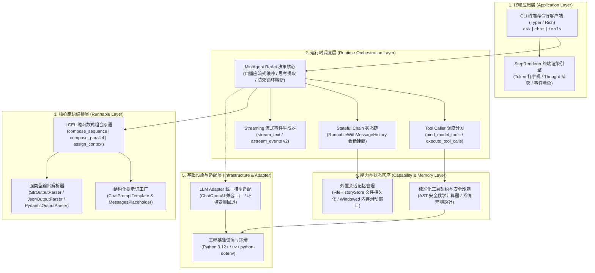
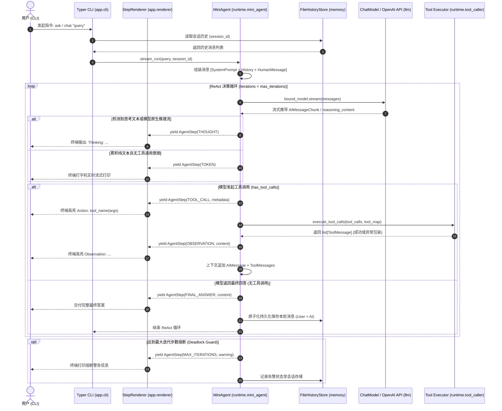

# AgentFlow

> **基于 LangChain LCEL 核心原语构建的轻量级单智能体（Single-Agent）ReAct 运行时框架与工程参考实现**  
> *A Lightweight Single-Agent ReAct Runtime & LCEL Engineering Reference, evolved from Vanilla Runtimes.*

[](https://www.python.org/downloads/)
[](https://python.langchain.com/)
[](https://github.com/astral-sh/uv)
[](https://github.com/astral-sh/ruff)
[](tests/)

[ 简体中文 ](README.md) | [ English ](README.en.md)

---

## 1. Overview (项目概览)

### What is AgentFlow?
**AgentFlow** 是一个以工业级软件工程标准构建的轻量级单智能体（Single-Agent）ReAct 运行时参考实现与工程系统。项目以 LangChain 表达式语言（LCEL）与统一 `Runnable` 协议为计算底座，深入解构并实现了具备双模态思考捕获（Thought）、动态工具调用（Tool Calling）、自适应打字机流式响应（Streaming）与会话级持久化隔离（Session Memory）的端到端自主智能体决策闭环。

### Why does it exist?
在构建自主智能体（Autonomous Agent）的过程中，开发者常面临自研底层 Runtime 维护成本过高与过早引入复杂状态图导致认知过载的双重困境。传统自研或初代 Agent 运行时暴露出以下核心痛点：
1. **协议碎片化与胶水代码冗余**: 不同模型厂商接口规范各异，需要手写大量适配代码将模型原生响应转为内部 Message 字典，代码脆弱且难以维护。
2. **缺乏统一函数式计算组合范式**: 命令式逻辑通过层层嵌套的函数传参连接，无法天然且零成本地同时赋能同步（Invoke）、异步（Async）、流式（Stream）与批处理（Batch）能力。
3. **流式管道中断与首字延迟卡顿**: 管道中一旦引入结构化解析器或格式化节点，手写生成器极易发生缓冲阻塞，且难以区分流出的是“思考推理”、“工具意图”还是“最终文本”。
4. **工具体系与 Schema 维护脆弱**: 依靠自研反射提取函数签名拼接 JSON Schema 极其脆弱，缺乏参数前置强类型校验与执行期异常安全拦截，工具抛错直接引发进程崩溃。
5. **状态与存储硬编码耦合**: 将 `self.history` 作为私有数组直接维护在 Agent 类实例内部，导致并发多会话状态污染，且难以无缝插拔替换本地或分布式存储介质。
6. **循环缺乏安全熔断与状态透传**: 命令式循环易因模型幻觉陷入死循环互调，同时上下文元数据（trace_id, session_id）层层穿透污染业务函数签名。

AgentFlow 严格遵循**“函数式纯净管道、状态外置隔离、工具强类型契约、流式自适应穿透、防死循环熔断保护”**的设计哲学，在不引入重量级图引擎的前提下，系统化验证并交付了工业级高可靠的单智能体基础运行时。

---

## 2. Implemented Features (已实现核心能力)

> **当前状态**: 本项目全阶段架构演进已**全部开发完成**，并通过 43 项单元与集成测试验证（100% PASS）。

- **纯 LCEL 管道声明式编排**: 基于统一的 `Runnable` 抽象与管道重载操作符（`|`），提供串行管道（`compose_sequence`）、并行多分支（`compose_parallel`）、纯函数封装（`make_lambda`）与上下文直通赋值（`assign_context`）。
- **MiniAgent ReAct 决策主闭环**: 单步意图推理完全由 LCEL 模型管道驱动，外层轻量控制环提供最大迭代步数（`max_iterations`，默认 5 步）防死锁熔断保护。
- **双模态低延迟思考捕获 (Thought Capture)**:
  - **原生推理流**: 实时提取 DeepSeek-R1 / 推理模型的 `reasoning_content` 增量并即时派发；
  - **前置意图规划提取**: 智能捕获模型在工具调用前输出的自然语言规划，将其升格为 `THOUGHT` 事件，实现终端毫秒级（<0.3s）推理反馈。
- **强类型工具契约与安全沙箱**: 基于 `@tool` 装饰器与 Pydantic `BaseModel` 自动推导标准 Function Calling JSON Schema；内置基于 Python AST 抽象语法树递归求值的安全数学计算器（杜绝动态 `eval` 隐患）与宿主环境探针。
- **动态自适应打字机流式响应 (Streaming)**:
  - 独创双阶段流式缓冲机制：非工具轮次前 100 字符自适应判别意图，工具回传合成轮次直通零延迟；
  - 结合 `StepRenderer` 终端引擎实现 Token 级实时打字机流式穿透；
  - 支持基于 LangChain `astream_events` v2 派发细粒度生命周期事件流。
- **无状态核心与本地持久化会话记忆 (Session Memory)**:
  - 基于 `session_id` 实现多会话严格物理隔离；
  - `WindowedChatMessageHistory`: 内存消息队列，写入时自动执行滑动窗口截断；
  - `FileHistoryStore`: 持久化存储于本地 `.sessions/{session_id}.json`，使用官方标准的 `message_to_dict` / `messages_from_dict` 进行无损序列化；
  - `runtime/stateful_chain.py`: 提供 `RunnableWithMessageHistory` 包装器，一键为任意纯函数式 LCEL 管道挂载多轮会话状态。
- **工业级终端命令行交互客户端 (CLI)**:
  - `jarvis ask`: 单次任务即时推演，自动完成工具调用、实时打字机流式输出并持久化记录上下文；
  - `jarvis chat`: 交互式终端 REPL 多轮会话，支持 `/quit` 退出与 `/clear` 会话清空；
  - `jarvis tools`: 格式化打印当前运行环境中所有注册工具的元数据与入参参数定义。
- **统一大模型适配网关**:
  - `llm/client.py` 统一封装 `get_chat_model()`，平滑对接 OpenAI、DeepSeek、Moonshot、本地 Ollama 等任何 OpenAI 兼容协议；
  - 原生支持环境变量回退机制（`OPENAI_MODEL_NAME`, `OPENAI_API_KEY`, `OPENAI_BASE_URL`）。
- **100% 离线自动化质量测试门禁**: 43 项覆盖基础架构、LCEL 原语、提示词工程、工具沙箱、打字机流式、持久化记忆与端到端 ReAct 循环的自动化测试用例，完全隔离外部网络调用，全部通过。

---

## 3. Architecture (系统架构)

AgentFlow 采用严格的单向分层解耦架构，从终端交互层到底层基础设施具备清晰的契约边界：



### 核心执行流转时序 (ReAct 决策与工具调用闭环)



---

## 4. Core Concepts (核心概念)

| 核心概念 | 定义与在 AgentFlow 中的职责 |
| :--- | :--- |
| **MiniAgent** | 紧凑型 ReAct 智能体。单轮会话中调度“思考 $\to$ 决策动作 $\to$ 执行工具 $\to$ 观察反馈 $\to$ 总结答案”的闭环调度器。 |
| **Runnable 统一协议** | LangChain 核心抽象基石。统一暴露 `invoke`、`batch`、`stream`、`ainvoke`、`astream` 契约，支持 Unix 管道式声明式组合。 |
| **LCEL 组合原语** | 管道操作符重载（`|`），提供串行管道（`compose_sequence`）、并行（`compose_parallel`）与直通注入（`assign_context`）。 |
| **AgentStep** | 运行时事件抽象。承载 `THOUGHT`（思考）、`TOOL_CALL`（意图）、`OBSERVATION`（执行结果）、`TOKEN`（字符）、`FINAL_ANSWER`（终态回答）与 `MAX_ITERATIONS`（熔断）。 |
| **Tool 契约沙箱** | 基于 Pydantic 的自描述工具。自动推导 JSON Schema，执行异常就地封装为 `ToolMessage(status="error")` 供模型自我修复。 |
| **FileHistoryStore** | 本地 JSON 会话存储管理器（存储于 `.sessions/{session_id}.json`）。支持多会话隔离、跨命令持久化与滑动窗口自动裁剪。 |
| **WindowedChatMessageHistory** | 内存滑动窗口消息历史。严格限制消息队列上限（`max_messages`），防止上下文超限与 Token 浪费。 |
| **StepRenderer** | 终端格式化与渲染引擎。负责将底层 `AgentStep` 事件解耦转换为兼具美感与低延迟的打字机流式交互。 |

---

## 5. Project Structure (关键目录结构)

```text
AgentFlow/
├── app/                  # 终端应用交互层 (Typer CLI, 格式化渲染器)
│   ├── cli.py            # CLI 命令定义: ask, chat, tools
│   ├── main.py           # Typer 启动入口与命令分发
│   └── renderer.py       # StepRenderer 打字机与事件流渲染器
├── runtime/              # 核心运行时调度层 (MiniAgent, LCEL 组合, 工具分发)
│   ├── mini_agent.py     # MiniAgent ReAct 主循环、自适应缓冲与熔断控制
│   ├── runnables.py      # LCEL 纯函数式组合原语 (sequence, parallel, passthrough)
│   ├── stateful_chain.py # 带状态 RunnableWithMessageHistory 包装与调用
│   ├── streaming.py      # 文本块流式与 astream_events v2 事件流生成器
│   └── tool_caller.py    # 模型工具绑定 (bind_tools) 与安全分发执行
├── llm/                  # 模型适配层 (OpenAI / DeepSeek / Ollama 统一接口)
│   └── client.py         # get_chat_model 跨厂商统一工厂函数
├── prompts/              # 结构化提示词与输出解析层
│   ├── templates.py      # ChatPromptTemplate 与 MessagesPlaceholder 模板工厂
│   └── parser.py         # 纯文本、JSON 与 Pydantic 强类型校验解析器
├── tools/                # 标准化工具层 (BaseTool / @tool)
│   ├── calculator.py     # 基于 AST 抽象语法树的安全数学计算器
│   └── system.py         # 宿主操作系统与 Python 运行时环境探针
├── memory/               # 会话状态持久化与记忆层
│   └── history.py        # 内存滑动窗口与本地 JSON 文件持久化 Store
├── docs/                 # 完整工程架构说明、设计规范、ADR 与演进路线图
├── tests/                # 43 项覆盖全生命周期的自动化单元与集成测试套件
├── pyproject.toml        # 项目依赖、构建与工具链配置
├── .env.example          # 环境变量配置模板
└── uv.lock               # 跨平台依赖确定性锁定文件
```

---

## 6. Getting Started (快速开始)

### 6.1 环境要求
- **Python**: `>= 3.12` (已通过 Python 3.12 与 Python 3.14 环境验证)
- **包管理工具**: 推荐使用 [uv](https://github.com/astral-sh/uv)（极速且确定性）

### 6.2 安装与同步依赖

```bash
# 1. 克隆代码仓库
git clone <repository_url>
cd AgentFlow

# 2. 使用 uv 一键安装依赖并创建虚拟环境
uv sync

# 3. 创建环境变量配置文件
cp .env.example .env    # Linux / macOS
# 或者 Windows PowerShell:
# Copy-Item .env.example .env
```

### 6.3 快速体验 CLI 交互

```bash
# 1. 查看已注册的工具清单及其参数 Schema
uv run python -m app tools

# 2. 单次提问：自动调用 AST 计算器与系统探针，打字机流式输出
uv run python -m app ask "请帮我计算 (123 * 45) + 678 并查看当前操作系统"

# 3. 体验多会话持久化记忆隔离 (跨命令保持上下文)
uv run python -m app ask "你好，我的名字是张三" --session-id user_01
uv run python -m app ask "你还记得我的名字吗？" --session-id user_01

# 4. 启动交互式多轮 Agent 终端会话
uv run python -m app chat --session-id test_chat
```

> **说明**: 项目在 `pyproject.toml` 中注册的脚本入口为 `jarvis`。你可以通过 `uv run jarvis <command>` 或 `uv run python -m app <command>` 运行。

### 6.4 连接真实大语言模型

AgentFlow 原生支持任何兼容 OpenAI 协议的模型提供商（OpenAI、DeepSeek、Moonshot、Ollama 等）。编辑 `.env` 文件即可生效：

```dotenv
# 必填：API 密钥
OPENAI_API_KEY=your_actual_api_key_here

# 可选：自定义服务接入点（如 DeepSeek 或本地 Ollama）
OPENAI_BASE_URL=https://api.openai.com/v1

# 可选：默认模型名称（如 deepseek-chat 或 gpt-4o-mini）
OPENAI_MODEL_NAME=gpt-4o-mini
```

### 6.5 运行全量自动化测试

```bash
uv run pytest
```
*当前全量 43 项测试用例在离线状态下全部通过（PASS），平均耗时小于 4 秒。*

---

## 7. Configuration (环境配置说明)

| 环境变量 | 默认值 | 说明 |
| :--- | :--- | :--- |
| `OPENAI_API_KEY` | `dummy-key-for-local-dev` | 大语言模型访问密钥（接入真实模型时必填；单测环境下使用 Mock 隔离无需真实 Key）。 |
| `OPENAI_BASE_URL` | `https://api.openai.com/v1` | 兼容服务接入端点（支持 DeepSeek `https://api.deepseek.com/v1`、Ollama `http://localhost:11434/v1`）。 |
| `OPENAI_MODEL_NAME` | `gpt-4o-mini` | 默认模型标识符（如 `deepseek-chat`、`gpt-4o`、`qwen2.5:7b`）。 |

会话历史持久化文件默认存储在当前工作目录的 `.sessions/{session_id}.json`（可通过 `--session-id` 参数区分会话）。

---

## 8. Development & Quality Gates (工程开发与质量门禁)

本项目严格遵循代码质量门禁纪律，所有功能合并前必须保证门禁全绿：

```bash
# 运行代码静态检查 (Lint)
uv run ruff check .

# 运行代码排版格式化校验 (Format Check)
uv run black --check .

# 运行全量单元与端到端集成测试 (43 项测试)
uv run pytest -v
```

---

## 9. Documentation (技术文档导航)

完整的设计与架构深度解析已标准化沉淀至 `docs/` 目录：

```text
docs/
├── architecture/                     # 架构体系与机制解构
│   ├── system-architecture.md        # 六层分层架构、数据流、边界规范与设计约束
│   └── migration-map.md              # 自研底层 Runtime 到 LangChain LCEL 9 大维度全量映射手册
├── design/                           # 核心组件专项设计
│   ├── mini-agent.md                 # MiniAgent ReAct 决策循环、思考提取与流式缓冲策略
│   └── tools-and-memory.md           # 工具沙箱契约与本地文件会话持久化设计
├── development/                      # 开发者指引与工程规范
│   └── development-guide.md          # 现代化环境搭建、配置、命令、测试与质量门禁
├── adr/                              # 架构决策记录 (ADR)
│   ├── ADR-001-why-langchain.md      # ADR-001: 为什么选择 LangChain LCEL 作为标杆
│   ├── ADR-002-runnable-first.md     # ADR-002: 为什么将 Runnable 确立为第一攻坚目标
│   ├── ADR-003-no-langgraph-yet.md   # ADR-003: 为什么暂不引入 LangGraph
│   └── ADR-004-session-file-memory.md# ADR-004: 为什么单智能体阶段采用本地 JSON 文件记忆
└── roadmap/                          # 演进与研发规划
    └── roadmap.md                    # 9 阶段已交付详情与后续演进路线图
```

---

## 10. Roadmap (演进路线图)

AgentFlow 前序规划的九个递进演进阶段已**全部开发完成并验证通过**：

### Completed (全部完成)
- ✅ **Phase 0: Design Gate**: 架构顶层全景设计、概念映射表与 ADR 核心架构决策。
- ✅ **Phase 1: Project Skeleton**: 现代 Python 模块化分层目录骨架与单向依赖隔离。
- ✅ **Phase 2: Dev Infrastructure**: 基于 uv、Ruff、Black、pytest 的工具链与自动化测试冒烟基建。
- ✅ **Phase 3: Runnable Foundation**: 统一 LCEL 原语管道（`compose_sequence`, `compose_parallel`, `assign_context`）。
- ✅ **Phase 4: Prompt Engineering**: 结构化 `ChatPromptTemplate` 模板与 Pydantic 强类型输出校验解析器。
- ✅ **Phase 5: Tool Calling**: `@tool` 工业级 Schema 绑定、AST 安全数学计算器与平台环境探针。
- ✅ **Phase 6: Streaming**: Token 级打字机流式穿透、`StepRenderer` 终端着色与 `astream_events` v2 支持。
- ✅ **Phase 7: Memory**: 内存滑动窗口截断（`WindowedHistory`）与本地 JSON 文件持久化（`FileHistoryStore`）。
- ✅ **Phase 8: Mini Agent**: 完整 LCEL 驱动的 ReAct 决策循环、双模态思考捕获与防死锁熔断保护。
- ✅ **Application Layer: CLI**: 完整的交互式终端交互命令（`ask`, `chat`, `tools`）。

### Future & Extension Outlook (后续展望与生态扩展)
- [ ] **平滑进阶图编排系统**: 对接同目录下的 **AgentGraph** 项目，引入 LangGraph StateGraph 有向有环图、无状态人机审批（HITL Interrupt）与 SQLite 时空快照（Time Travel）。
- [ ] **多智能体协作网络 (Multi-Agent Swarm)**: 探索 Supervisor 层次化调度与对等网络协同。
- [ ] **知识库与 RAG 检索增强**: 集成标准 Document Loaders、向量存储与混合语义召回。
- [ ] **MCP (Model Context Protocol) Client**: 接入标准化分布式远程工具发现与调用协议。
- [ ] **Web API 服务化暴露**: 基于 FastAPI 暴露 RESTful 接口与 SSE（Server-Sent Events）实时流式推送。

---

## 11. Metadata Note (工程元数据说明)

项目正式更名为 **AgentFlow**。为保持现有迁移演进与命令行习惯的向前兼容，代码包与 CLI 脚本元数据（如 `pyproject.toml` 中的 `jarvis = "app.main:run"`）暂时保留兼容别名。运行 `uv run python -m app <command>` 与 `uv run jarvis <command>` 具备完全相同的执行行为。
